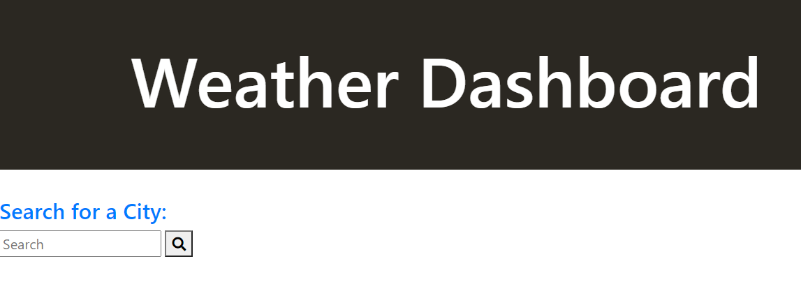

# weather-dashboard-application
A weather dashboard that will run in the browser and feature dynamically updated HTML and CSS

# Description

I really struggled with this exercise. I was able to pull the needed array from the api. Where I hit a major hurdle was displaying the desired weather conditions. Also, again I struggled a lot with local storage. In the console log I could see that I successfully pulled all data and built an array of past city searches, but in the end I was unsuccessful at displaying the items.

My disastrous attempt was not due to a time constraint. I believe I spent 15-20+ hours trying to accomplish the HW requirements with minimal success. 

https://janee-elise-mays/weather-dashboard-application
